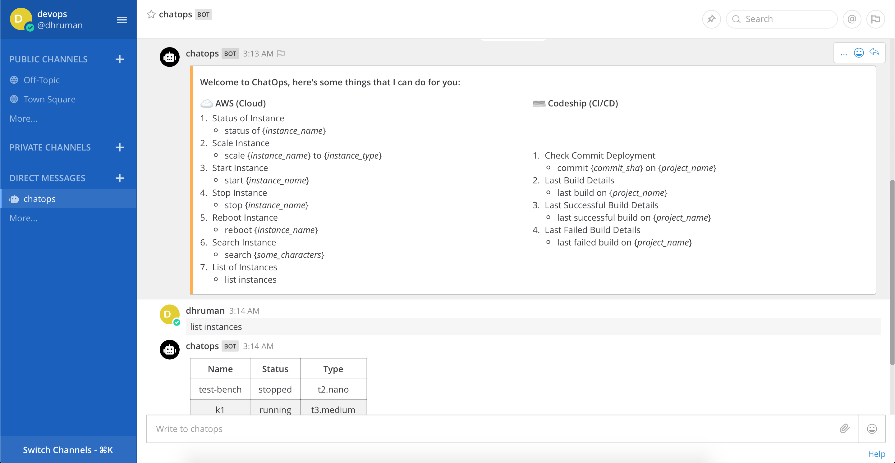

ChatOps Bot 
----------

------



## 1. Features

- **Service integrations:** Bot integrates with AWS, CodeShip & Gitlab.
- **Build Notifications:** Bot can notify the users for start, success or failures of the build from CodeShip.
- **Start/Stop/Reboot AWS Instances:** Bot allows user to start/stop/reboot any instances from configured AWS accounts. The bot connects to AWS using provided credentials. 
- **Commit deployment status:** Check whether a specific commit is deployed in the latest build or not. This feature uses Gitlab API & CodeShip APIs to fetch the commit data & build data to notify the user about build status. 
- **Scale your AWS instances on the fly:** Bot allows users to scale their EC2 instances on the fly using chatbot. 
- **Authority management on resources:** The system allows to define managers to different instances in AWS, which enables the permission flows for the resources. E.g. If someone wants to scale the instance it will ask the manager first and once manager approves the request then and only then it will scale the instance. 
- **Check stats of the instances:** User can query the bot to check statistics of an instance. Bot replies with nice graphs with latest statistics for the instances. 
- **Keep everyone updated:** Admin can add stakeholders for the resources, and if someone updates that resource (e.g. start/stop of an instance) it will notfiy all the stakeholders that an operation is being carried out on that instance. Super useful to keep everyone notified about infrastructure changes in a project. 
- **Communicate in natural language:** Bot uses Google DialogFlow as its NLP engine which makes sure that user doesn't have to remember any commands and he can converse in natural language with the bot. 


## 2. Configuration

#### 2.1 Prerequisite

1. Mattermost (https://mattermost.com/download/)
2. Mysql and config with Mattermost
3. AWS Account
4. GitLab Account
5. Google Account
6. Codeship Account
7. Python3.7

#### 2.2 Mattermost Config

1. Create a account on Mattermost
2. Go to system console and click on bot accounts then click Integrations > Bot Accounts link after click on add bot account
3. create a new bot and check post:all and post:channels Enabled and save the bot token
4. Put Mattermost server url, bot-username and bot-token in config.py file

#### 2.3 Dialogflow Config

1. create a project in google developer console
2. create a service account with dialogflow api role
3. download credential file and set GOOGLE_APPLICATION_CREDENTIALS variable in environment variables
4. Put dialogflow project name and client id in config.py file
5. Import DialogFlow agent (Check [this guide](https://miningbusinessdata.com/how-to-import-an-agent-zip-file-into-api-ai/))
6. The zip file to restore agent is in the source code with name DialogflowAgent.zip

#### 2.4 AWS Config

1. Put aws_access_key_id, aws_secret_access_key and region_name in config.py file

#### 2.5 Codeship Config

1. To configure build notifications, go to your Project Settings and then click into the Notifications tab.
2. Then Add New Notification with Webhook and Config Url with (BASE_URL/codeship/)
3. Put Codeship email and password in config.py file

#### 2.6 Gitlab Config

1. Go to gitlab setting then click on access token
2. Create Private Access Token (Grant permission of api)
3. Put access token in config.py file 

#### 2.7 Database Config

1. Put database name ,username, password, port in config.py file 

## 3. Get up and running

1. Start Mattermost server

2. Create & activate virtual environment

   ```shell
   $ python3 -m venv ./venv
   $ source ./venv/bin/activate
   ```

3. install requirements 

   ```shell
   $ pip install -r requirements.txt
   ```

4. Make & run the migrations

   ```shell
   $ python manage.py makemigrations
   $ python manage.py migrate
   ```

5. Collect the static files

   ```shell
   $ python manage.py collectstatic
   ```

6. Create a super admin for the access

   ```shell
   $ python manage.py createsuperuser
   ```

7. Run the django server

   ```shell
   $ python manage.py runserver
   ```

8. Access the admin panel at <u>BASE_URL/admin</u>


